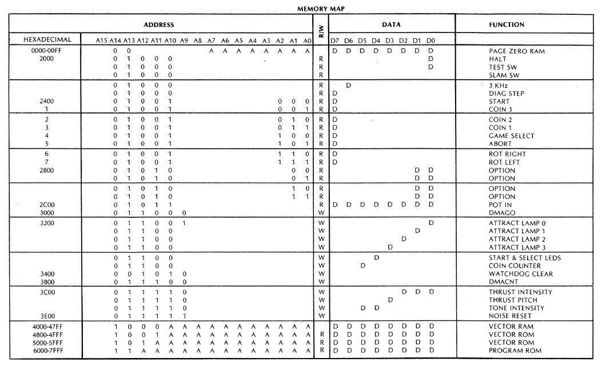

## Cabinet buttons and lamps

The <a href="https://lakeside-arcade.com/2026/03/07/lunar-lander-pcb-repair-logs/">Lakeside Arcade - Lunar Lander PCB Repair Logs</a>
has a helpful excerpt from the service manual showing the memory map for the arcade console:



There are five buttons on the controls, Rotate Right, Rotate Left, Abort, Start and Select.
These are all memory mapped into the 6502's address space and set bit 7 in the byte
when they are pressed.

```
.byte 2400 IO_in1_start			; Memory mapped active high button for start game
.byte 2404 IO_in1_select		; Memory mapped active high button for select difficulty level
.byte 2405 IO_in1_abort			; Memory mapped active high button for abort the mission
.byte 2406 IO_in1_yaw_right		; Memory mapped active high button for rotate to the right
.byte 2407 IO_in1_yaw_left		; Memory mapped active high button for rotate to the left
```

There are also three coin slots mapped into the same memory region:

```
.byte 2401 IO_in1_coin 3		; Three memory mapped active high coin slots
```

The lamps and sounds are also memory mapper peripherals.  Eight output pins are mapped to the
one address.  The system caches the last value to avoid read-modify-write problems with this location.

```
; --------0 Attract lamp 0
; -------1- Attract lamp 1
; ------2-- Attract lamp 2
; -----3--- Attract lamp 3
; ----4---- Start/select LEDs
; ---5----- Coin counter enable
.byte 3200 IO_output_latch			; Lamps 0 - 3, Start, Select, Coin enable

; -----210 Thrust intensity
; ----3--- Thrust pitch
; --54--- Tone intensity
.byte 3c00 IO_audio_latch			; Audio output control
.byte 3e00 IO_audio_reset			; Turn off the audio device
```

To avoid read-modify-write cycles when updating the lamps or audio devices, the game keeps track
of the last value written in a global variable and uses that as its cache.  The functions take two
parameters and act as a SET and RESET value.


```
; Set the audio output hardware
;
; A = keep_bits
; X = set_bits
;
; last_set = set_bits
; cache = (keep & cache) | set_bits
; output = cache

.func io_audio_set:
7953  2589    and NOISZP                 ; Mask the last written value to preserve the keep bits in `A`
7955  863c    stx TEMP6                  ; Store the set bits from `X` in the temp variable
7957  053c    ora TEMP6                  ; Set the set bits in `A`
7959  8d003c  sta IO_audio_latch         ; Write the new set bits and the kept bits out to the audio hardware
795c  8589    sta NOISZP                 ; Store this last written value in the cache
795e  60      rts                        ; And we're done!

; Set the lamps hardware
;
; A = keep_bits
; X = set_bits
;
; last_set = set_bits
; cache = (keep & cache) | set_bits
; output = cache
.func io_lamps_set:
795f  2588    and LAMPZP                 ; Mask the last written value to preserve the keep bits in `A`
7961  863c    stx TEMP6                  ; Store the set bits from `X` in the temp variable
7963  053c    ora TEMP6                  ; Set the set bits in `A`
7965  8d0032  sta IO_output_latch        ; Write the new set bits and the kept bits out to the lamp hardware
7968  8588    sta LAMPZP                 ; Store this last written value in the cache
796a  60      rts                        ; And we're done!
```
